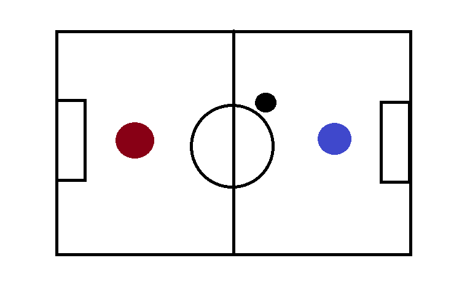
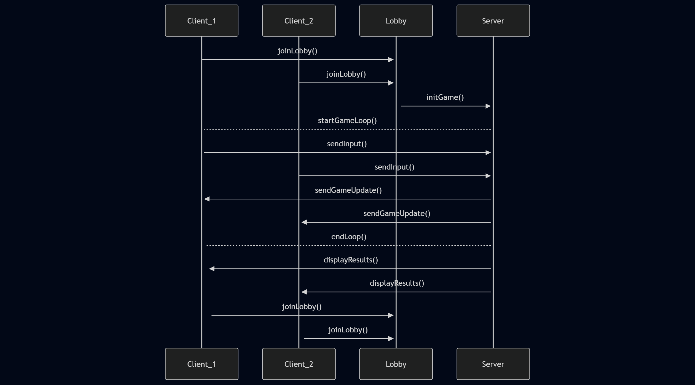
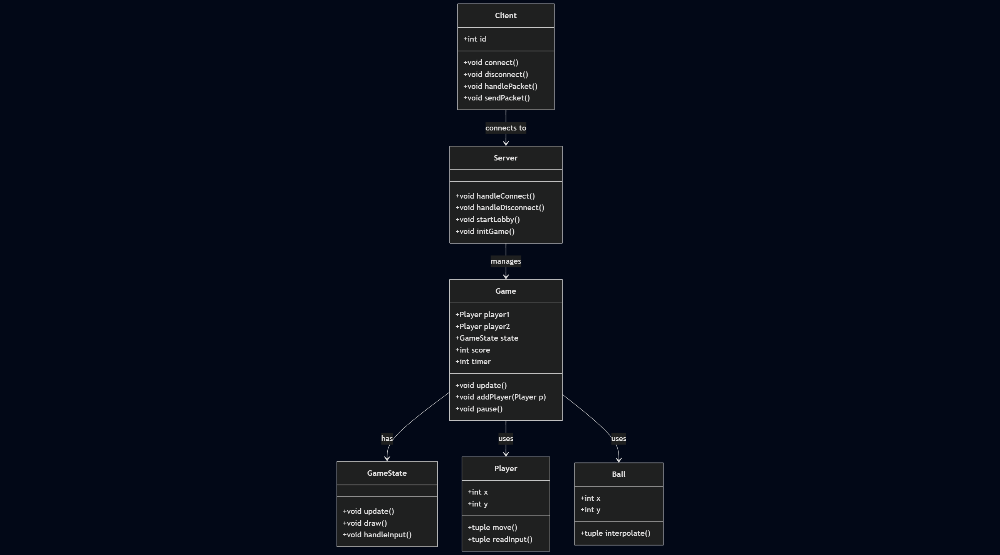

% Air Hockey
% Autor: Grupa 1A
% Data: \today

# Cześć 1
# Wprowadzenie do gry Air Hockey

## 1. Opis gry

Air hockey - gra, gdzie dwóch graczy odbija krążek przy użyciu okrągłej rakietki i
próbuje wbić go do bramki przeciwnika. Gra znana z automatów do gier występujących
powszechnie w Polsce.
Przykładowa plansza cyfrowej wersji air hockeya, gdzie czerwone i niebieskie kółko to gracz
A i gracz B, a czarne kółko to krążek, bramki to prostokąty po przeciwnych stronach planszy.

### Zasady gry

Gracze odbijają krążek rakietami i starają się wbić go do bramki przeciwnika. Krążek
można odbijać od ścian. Ruch rakietki jest ograniczono tylko do połowy boiska
należącej do gracza. Siła, z jaką odbity jest krążek od rakietki jest zależna od
prędkości z jaką został trafiony. Za każdą bramkę gracz dostaje 1 punkt, mecz trwa
skończoną ilość czasu ustaloną przez graczy na starcie i wygrywa gracz mający
więcej punktów. W przypadku takiej samej ilości punktów gra kończy się remisem.

### Sterowanie

Rakietki są poruszane przy pomocy myszki. Czułość myszy jest odgórnie
ograniczona, aby nie dawać przewagi graczowi z wysoką czułością myszy.

## 2. Synchronizacja

Pakiety wysyłane są co tick logiki gry. Gracz wysyła do serwera swój input w postaci
początkowej pozycji myszki i wektora przesunięcia, lub pozycji końcowej myszki.
Pakiety są przesyłane protokołem TCP pomiędzy graczami i serwerem. Obaj gracze
są traktowani jednakowo i nie komunikują się z sobą, a jedynie z serwerem. Serwer
odsyła do gracza co tick aktualny stan gry w postaci pozycji i wektorów ruchu
rakietek i krążka. Wysyłane też są informacje o grze, takie jak wynik i czas do końca
rozgrywki.

## 3. Protokół

Pakiety przesyłane są protokołem TCP, ponieważ dla aplikacji tej skali nie
jest wymagana wydajność i szybkość UDP, a implementacja komunikacji TCP jest już
nam znana.

## 4. Logika gry

Logika gry wykonywana jest zarówno na serwerze, jak i lokalnie u gracza. Zapewnia
to płynną symulację lokalnie oczekując na pakiety z serwera. Gracz wysyła do
serwera informacje o podjętych decyzjach (input) i czekając na odpowiedź serwera
wylicza następny tick na podstawie informacji jakie posiada. Po przeliczeniu
porównuje wartości z wartościami otrzymanymi od serwera i poprawia ewentualne
błędy po swojej stronie. Serwer prowadzi symulację gry, gdzie wylicza następny stan
gry na podstawie informacji otrzymanych od użytkowników. Poza prowadzeniem
symulacji nadrzędnej do tych u klientów zajmuje się też zarządzaniem pokojem gry
(połączenie obu graczy ze sobą) i rozwiązuje konflikty między graczami.

## 5. Architektura

Gra implementuje architekturę serwer-klient, ponieważ jest ona prostsza w
implementacji, ponieważ obaj gracze znają jedynie ip serwera i nie muszą
komunikować się między sobą. Rozwiązanie p2p wymagałoby TCP hole-punching
aby gracze mogli wysyłać pomiędzy sobą pakiety poprzez router domowy, co nie jest
wspierane przez wszystkie urządzenia.

\newpage
---
# Cześć 2
### **Diagram sekwencyji**

Diagram sekwencji klas naszego projektu:

1. **Dołączenie do gry:**
   - Gracze (`Client_1`, `Client_2`) łączą się z lobby gry (`joinLobby()`).
   - System lobby sprawdza dostępność miejsc i tworzy nową sesję gry.

2. **Inicjalizacja rozgrywki:**
   - Serwer (`Server`) inicjalizuje grę (`initGame()`), tworząc środowisko (boisko, krążek, graczy).
   - Gracze otrzymują potwierdzenie rozpoczęcia gry (`startGameLoop()`).

3. **Przebieg rozgrywki:**
   - Gracze przesyłają swoje ruchy (`sendInput()`) – np. pozycje paletek.
   - Serwer aktualizuje stan gry (pozycja krążka, kolizje, punkty) i wysyła synchronizację (`sendGameUpdate()`).
   - Proces powtarza się w pętli, aż do zakończenia meczu.

4. **Zakończenie gry:**
   - Serwer ogłasza wyniki (`displayResults()`), np. po osiągnięciu limitu punktów.
   - Gracze mogą ponownie dołączyć do lobby (`joinLobby()`), aby zagrać kolejną rundę.

### **Diagram klas**

Diagram klas naszego projektu:

- Client -  Reprezentuje klienta połączonego z serwerem.
- Server - Obsługuje połączenia klientów i uruchamia grę.
- Game -  Główna logika rozgrywki.
- GameState - Stan i logika aktualnej sesji gry.
- Player -  Reprezentuje gracza.
- Ball - Obiekt piłki w grze.
